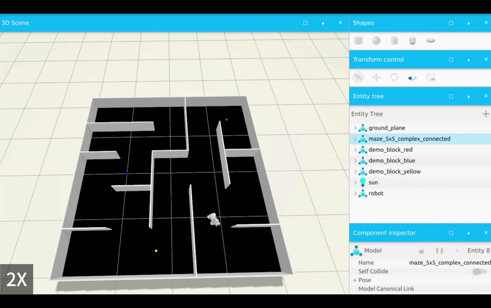

# WinterHack Robot Project

A comprehensive ROS2-based robotic system developed for WinterHack 2026, featuring autonomous navigation, manipulation capabilities, and computer vision integration.

## 🤖 Overview

This project integrates multiple robotics subsystems to create a complete autonomous mobile manipulator:

- **Autonomous Navigation**: Nav2-based path planning and obstacle avoidance with TEB local planner
- **Manipulation**: MoveIt2 integration for robotic arm control and motion planning
- **Computer Vision**: Object detection and localization using camera sensors
- **SLAM & Localization**: Real-time mapping and position tracking
- **Pick & Place Operations**: Automated object manipulation tasks

## 🎬 Demo

### Video Demonstrations

#### Gazebo Simulation
Watch the robot performing autonomous navigation and manipulation in simulation:

[](https://youtu.be/vOa1X8RrOgM)

🎥 [Watch on YouTube](https://youtu.be/vOa1X8RrOgM)

#### Real Robot Testing
See the system running on actual hardware:

[](https://youtu.be/jdtO_zQPL5k)

🎥 [Watch on YouTube](https://youtu.be/jdtO_zQPL5k)

### Screenshots

#### Gazebo Simulation Environment

*Robot navigating and performing pick-and-place tasks in simulated environment*

#### Real Robot Hardware Testing

*Physical robot executing autonomous navigation and manipulation tasks*

## 📦 Project Structure

```
winterhack_u/
├── config/               # Configuration files for localization and navigation
├── scripts/              # Utility scripts and testing tools
├── src/
│   ├── winterhack/       # Main package with core functionality
│   │   ├── launch/       # Launch files for different subsystems
│   │   ├── config/       # ROS2 control and MoveIt configuration
│   │   ├── maps/         # Pre-built maps for navigation
│   │   └── winterhack/   # Python nodes for mission execution
│   ├── robot_gazebo/     # Gazebo simulation environment
│   ├── holonomic_sim/    # Holonomic robot simulation
│   ├── landerpi_description/  # Robot URDF and mesh files
│   ├── teb_local_planner/     # Time Elastic Band path planner
│   ├── trac_ik/          # Inverse kinematics solver
│   └── costmap_converter/ # Dynamic obstacle conversion
```

## 🛠️ Key Components

### Main Package: `winterhack`

The core package contains:
- **Mission Runner**: High-level task coordination
- **Pick/Drop Servers**: Action servers for manipulation tasks
- **Locate Server**: Object localization and tracking
- **MoveIt2 Client**: Interface for arm motion planning
- **Gripper Client**: Control for end-effector operations
- **Detection Nodes**: Computer vision processing

### Launch Files

- `winterhack.launch.py` - Complete system startup
- `navigation.launch.py` - Nav2 navigation stack
- `slam.launch.py` - SLAM for map building
- `localization.launch.py` - AMCL localization
- `moveit.launch.py` - MoveIt2 manipulation system

## 🚀 Getting Started

### Prerequisites

- ROS2 (Humble or later recommended)
- Python 3.10+
- Gazebo (for simulation)
- Required dependencies:
  - Nav2
  - MoveIt2
  - OpenCV
  - tf2_ros

### Installation

1. Clone the repository:
```bash
git clone https://github.com/YOUR_USERNAME/winterhack_u.git
cd winterhack_u
```

2. Install dependencies:
```bash
rosdep install --from-paths src --ignore-src -r -y
```

3. Build the workspace:
```bash
colcon build --symlink-install
```

4. Source the workspace:
```bash
source install/setup.bash
```

## 🎮 Usage

### Running the Complete System

```bash
ros2 launch winterhack winterhack.launch.py
```

### Running Individual Subsystems

**Navigation Only:**
```bash
ros2 launch winterhack navigation.launch.py
```

**SLAM Mapping:**
```bash
ros2 launch winterhack slam.launch.py
```

**Manipulation Only:**
```bash
ros2 launch winterhack moveit.launch.py
```

### Testing

Run the hybrid alignment test:
```bash
python3 scripts/test_hybrid_alignment.py
```

## 🔧 Configuration

Key configuration files:
- `config/locate_hybrid.yaml` - Object localization parameters
- `src/winterhack/config/nav2_params_exploration.yaml` - Navigation tuning
- `src/winterhack/config/ros2_controllers.yaml` - Robot controller settings
- `src/winterhack/config/kinematics.yaml` - Arm kinematics configuration

## 🏗️ Architecture

The system uses a modular architecture with:
- **Action Servers** for pick/place operations
- **TF2** for coordinate frame management
- **TEB Planner** for smooth trajectory generation
- **TRAC-IK** for fast inverse kinematics solving
- **Costmap Converter** for efficient obstacle representation

## 📝 Documentation

Additional documentation files:
- `CONFIG_COMPARISON.md` - Configuration analysis
- `HYBRID_ALIGNMENT_README.md` - Alignment system details
- `IMPLEMENTATION_SUMMARY.md` - Implementation notes
- `QUICKSTART.md` - Quick start guide
- `TROUBLESHOOTING_TIMEOUT.md` - Common issues and fixes

## 🤝 Contributing

This project was developed for WinterHack 2026. Contributions and improvements are welcome!

## 📄 License

Apache-2.0 License

## 👥 Authors

Developed by QMUL team for WinterHack 2026

## 🙏 Acknowledgments

- Built on ROS2 and the open-source robotics community
- Uses TEB Local Planner, TRAC-IK, and Nav2 packages
- Robot model based on LanderPi platform
